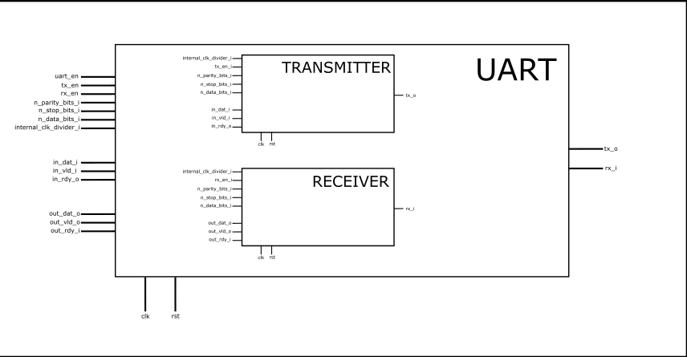

# Repository for rtl implementations of various archicecture components


## Uart

### Purpose of the project
Uart implementation is test of icarius verilog software for rtl simulation. Since icarius verilog is lightweight rtl simulator and can be easily tested under linux operating systems it seems to be interesting alternative for vendors simulators.
Another purpose is to create axi-stream compliant uart circuit. UART is often used as a peripheral in embedded systems. Typically (ARM architecutre) it is peripheral circuit configured by software. I wanted to create such a design in rtl.

### Rtl design assumptions
First of all list of all ports with description is provided.

| Name                   | Direction | Width | Description |
| -------------          | --------- | ----- | ----------- |
| clk                    | in        | 1     |             |
| rst                    | in        | 1     |             |
| uart_en                | in        | 1     | Clock enable |
| tx_en                  | in        | 1     | Transmitter on |
| rx_en                  | in        | 1     | Receiver on |
| n_parity_bits          | in        | 1     | Number of parity bits |
| n_stop_bits            | in        | 2     | Number of stop bits |
| n_data_bits            | in        | 4     | Number of data bits |
| internal_clk_divider_i | in        | 8     | transmitter on |
| in_dat_i               | in        | 9     | Data from master device |
| in_vld_i               | in        | 1     | AXIS handshake |
| in_rdy_o               | in        | 1     | AXIS handshake |
| out_dat_o              | out       | 9     | Data to master device |
| out_vld_o              | out       | 1     | AXIS handshake |
| out_rdy_i              | in        | 1     | AXIS handshake |
| tx_o                   | out       | 1     | UART TX |
| rx_i                   | in        | 1     | UART RX |

Circuit communicates with master device with AXI Stream interface (in_dat, out_dat). Additionaly it is connected to some configuration registers. Transmission parameters can be chosen that way. Design supports 5 to 9 data bits, 1-2 stop bits, 0-1 parity bits and it provides 8 bit clock divider to choose baud rate. For example for 115200 baud rate pand 10 MHz master clock it is necessary to set internal_clk_divider to 87. 

Following drawing is schematic of the circuit:


### Verification

Verification had two phasaes:
- Software verification with testbench
- Simple hardware test

The first phase was accomplished with use of icarius verilog. All testbenches can be found in directory `verif`. Unfortunataly it turned out that simulator do not support many objective features of SystemVerilog language. Despite that I managed to succesfully verify this design. Testing was very simple and demanded only command line. After adding Makefile it simplified to just writing proper make.
In order to run simulation following steps must be done:
- Install icarius verilog
- PRMCU_PATH variable must be set to local_path/prmcu 
- Run command from build directory in verif. Example command:
```shell 
make all NAME=uart_transmitter_tb FLAGS="-DN_BITS=6 -DTEST=20 -DRECV_RATE=115000"
```


